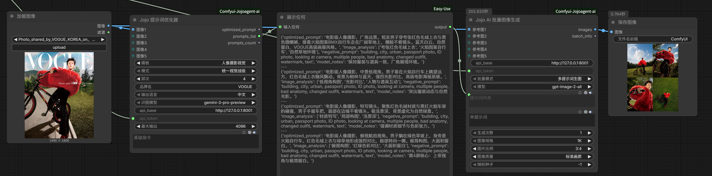
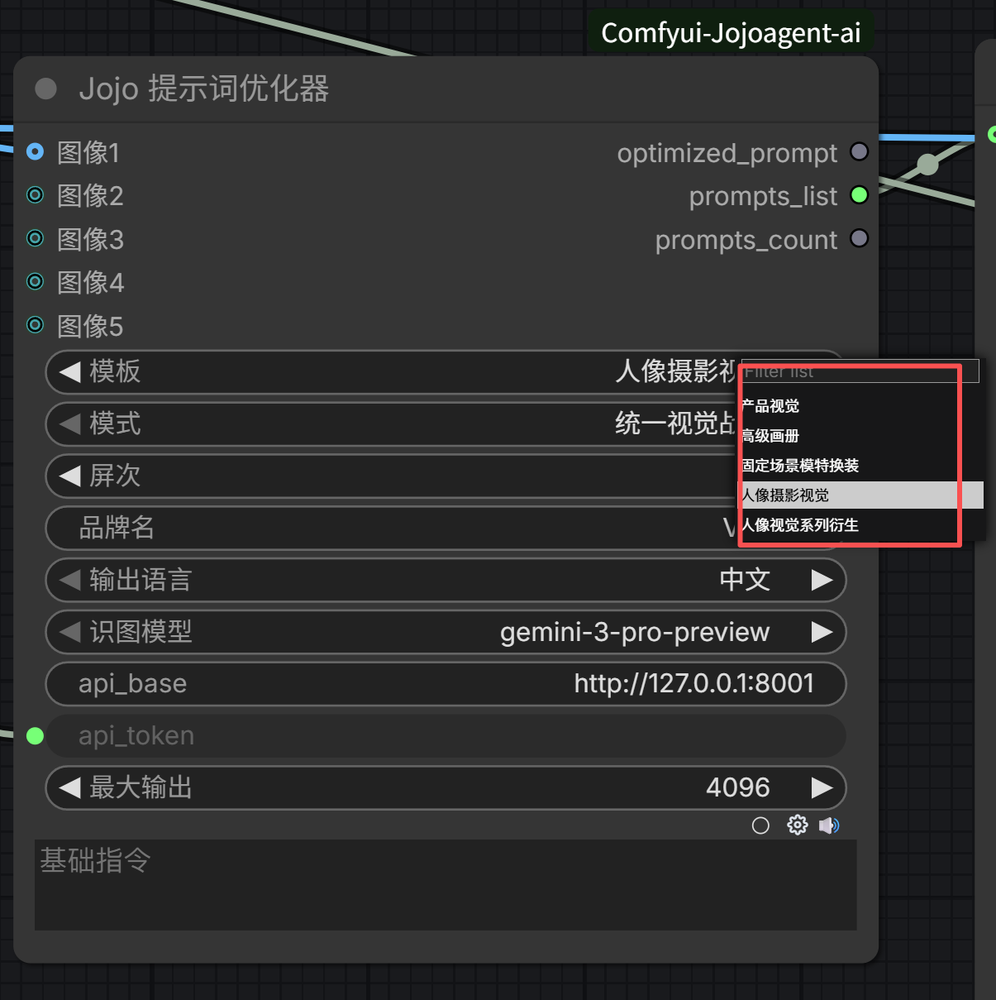
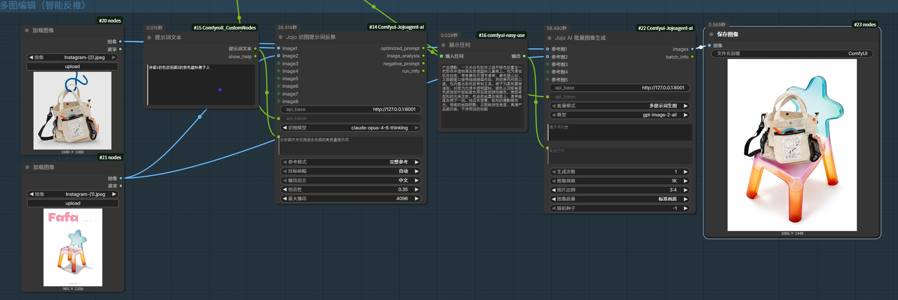
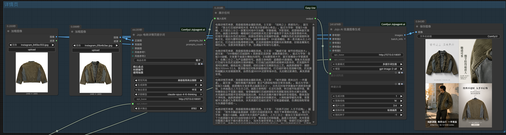
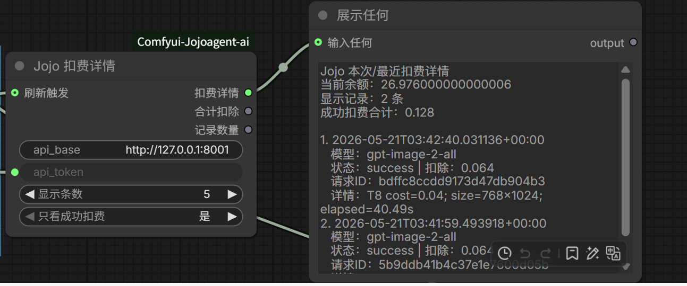

# Comfyui-Jojoagent-ai

Jojoagent 的 ComfyUI 客户端插件。用户填写 Jojoagent API 口令后，即可在 ComfyUI 中使用提示词优化、识图反推、电商详情页提示词、批量图像生成、账号余额和扣费详情等节点。

本插件面向电商视觉、产品海报、画册、人像摄影、模特换装和多图参考生成工作流，节点参数尽量使用中文，便于新手直接搭建工作流。



## 功能亮点

- 提示词优化器：支持产品视觉、高级画册、固定场景模特换装、人像摄影视觉、人像视觉系列衍生等模板。
- 多屏提示词输出：可输出 `optimized_prompt`、`prompts_list` 和 `prompts_count`，方便连接批量图像生成节点。
- 多图识图反推：支持 1-8 张图片输入，输出可用于生图的优化提示词、图片分析和负面提示词。
- 电商详情页提示词：支持正面图、背面图、侧面图、风格参考图，并生成多屏详情页提示词。
- 图像生成：支持单张生图和批量生图，包含图片规格、比例、画质、随机种子和参考图入口。
- 账号与用量：支持余额查询、最近用量查询和单次工作流扣费详情查看。

## 效果预览

### 提示词优化器



### 识图提示词反推



### 电商详情页提示词



### 扣费详情



## 安装

### 方法一：Git 安装

进入 ComfyUI 的 `custom_nodes` 目录：

```bash
cd ComfyUI/custom_nodes
git clone https://github.com/Jojo123-AI/Comfyui-Jojoagent-ai.git
```

安装依赖：

```bash
cd Comfyui-Jojoagent-ai
pip install -r requirements.txt
```

然后重启 ComfyUI。

### 方法二：手动安装

下载本仓库代码，把整个文件夹放到：

```text
ComfyUI/custom_nodes/Comfyui-Jojoagent-ai
```

安装依赖后重启 ComfyUI：

```bash
pip install -r requirements.txt
```

## API 配置

每个 Jojo 节点里都有两个常用参数：

```text
api_base
api_token
```

`api_base` 默认使用 Jojoagent 云端服务地址。  
`api_token` 请填写你获得的 Jojoagent API 口令。

示例：

```text
sk_xxxxxxxxx
```

## 节点清单

### Jojoagent/API

| 节点 | 功能 |
|---|---|
| Jojo 账号与用量 | 查询余额、查询最近用量。 |
| Jojo AI 图像生成 | 单张图像生成，支持参考图、比例、规格、画质和随机种子。 |
| Jojo AI 批量图像生成 | 多提示词批量生图，或单提示词多次生成。 |
| Jojo 扣费详情 | 查看最近扣费记录、成功扣费合计和当前余额。 |

### Jojoagent/Prompt

| 节点 | 功能 |
|---|---|
| Jojo 提示词优化器 | 根据模板、模式、屏次、品牌名和基础指令生成高质量提示词。 |
| Jojo 电商详情页提示词 | 基于商品图、卖点和视觉风格生成多屏详情页提示词。 |
| Jojo 识图提示词反推 | 输入多张图片，反推适合生图的提示词、图片分析和负面提示词。 |

### Jojoagent/Text

| 节点 | 功能 |
|---|---|
| Jojo 文本工具 | 合并文本、分割文本、选择单条、范围选择、重复文本、批次分组、标记提取。 |

### Jojoagent/Image

| 节点 | 功能 |
|---|---|
| Jojo 图片工具 | 合并加载图片、缩放图片、范围选择、预览透传。 |

### Jojoagent/Utils

| 节点 | 功能 |
|---|---|
| Jojo 文件夹扫描 | 扫描图片、文本、视频、音频或全部文件。 |
| Jojo 媒体路径加载 | 输出视频、音频或任意文件路径。 |
| Jojo 运行索引 | 每次运行自增，也可手动重置。 |

## 当前模型

图像生成模型：

```text
gpt-image-2-all
gemini-3.1-flash-image-preview
```

识图与提示词模型：

```text
gemini-3.1-flash-lite-preview
gemini-3.1-flash-lite-preview-thinking-high
gemini-3-pro-preview
claude-opus-4-6-thinking
```

## 使用建议

1. 先用 `Jojo 账号与用量` 检查 API 口令是否可用。
2. 需要生成提示词时，优先使用 `Jojo 提示词优化器` 或 `Jojo 电商详情页提示词`。
3. 需要根据图片反推提示词时，使用 `Jojo 识图提示词反推`。
4. 需要批量出图时，把 `prompts_list` 接到 `Jojo AI 批量图像生成`。
5. 跑完工作流后，可以用 `Jojo 扣费详情` 查看本次或最近扣费记录。

## 常见问题

### 连接失败

请检查：

- `api_token` 是否填写正确。
- 网络是否能访问 Jojoagent API 服务。
- ComfyUI 是否已经重启并加载最新版插件。

### HTTP 500 / 502 / 503

这通常表示 API 服务或模型通道暂时不可用。可以稍后重试，或者切换其它可用模型。

### Value not in list

这通常是旧工作流保存了旧参数值。请重新添加对应节点，或把参数重新选择为当前列表中的中文选项。

## 更新插件

如果使用 Git 安装，进入插件目录后执行：

```bash
git pull
```

然后重启 ComfyUI。

如果是手动安装，请下载最新代码覆盖旧插件文件夹，再重启 ComfyUI。

## 合作交流

合作和交流请添加：

```text
WX: Jojoai_x
```


